# Model

Het staat model voor digitale tuintjes welke bij 'Het web is voor iedereen' door studenten worden gemaakt.

tekst + foto's

## Learning Log

# Sprint 2:

# Sprint 1:

## Vrijdag 18 september

## voorbereiding vrijdag 18 september

## Woensdag 16 september

## voorbereiding woensdag 16 september

## Maandag 14 september

### Bi-Weekly geek 1

Tijdens de eerste Bi-Weekly Geek stond de werking, betrouwbaarheid en verantwoordelijkheid van het internet centraal. We gingen in groepjes aan de slag met verschillende hoofdvragen. Het doel was om te leren hoe je een grote vraag kunt opdelen in kleinere deelvragen en daar vervolgens passende onderzoeksmethoden bij kunt zoeken.

#### Onze hoofdvraag

Mijn groepje bestond uit Judith, Eva, Seb en Massimo. Wij kregen de volgende hoofdvraag:
Moeten kritieke internetdiensten in handen zijn van commerciële bedrijven?

Deze vraag sluit aan bij de voorbereiding over cloudbedrijven en de macht van grote technologiebedrijven. Veel websites en apps zijn afhankelijk van commerciële bedrijven zoals Amazon, Microsoft en Google. Wanneer één van deze bedrijven een grote storing heeft, kunnen veel verschillende diensten tegelijk uitvallen.

Voordat we de hoofdvraag konden beantwoorden, moesten we eerst bedenken welke informatie we nodig hadden. Daarom hebben we de hoofdvraag opgesplitst in kleinere deelvragen.

#### Onze deelvragen

Samen bedachten we de volgende deelvragen:

1. Wat zijn kritieke internetdiensten?
2. Welke bedrijven vallen onder commerciële bedrijven?
3. Over welke data beschikken kritieke internetdiensten?
4. Wat zijn de voor- en nadelen van kritieke internetdiensten in handen van commerciële bedrijven?
5. Wie heeft de kritieke internetdiensten op dit moment in bezit of onder controle?

Deze deelvragen bekijken de hoofdvraag vanuit verschillende kanten. We moeten eerst begrijpen wat kritieke internetdiensten zijn en welke bedrijven ze beheren. Daarna kunnen we onderzoeken welke gegevens deze diensten verwerken en wat de mogelijke voordelen en risico’s van commercieel beheer zijn.

#### Werkblad uitwisselen

Nadat iedere groep deelvragen had bedacht, wisselden we onze werkbladen uit. Iedere groep kreeg daardoor het blad van een andere groep.

Bij het tweede onderdeel moesten we niet zelf nieuwe deelvragen bedenken. We bekeken de deelvragen van de andere groep en zochten bij iedere vraag een passende onderzoeksmethode. Hiermee onderzochten we hoe de groep informatie kon verzamelen om de hoofdvraag uiteindelijk zo goed mogelijk te beantwoorden.

We dachten bijvoorbeeld na over methoden zoals:

- deskresearch;
- artikelen en betrouwbare bronnen vergelijken;
- experts interviewen;
- verschillende bedrijven of diensten vergelijken;
- bestaande gegevens en onderzoeken analyseren.

Door het werkblad uit te wisselen, kregen we een andere kijk op de vragen. We moesten niet alleen nadenken over wat iemand wilde weten, maar vooral over hoe die informatie onderzocht kon worden.

Van het tweede werkblad heb ik helaas geen foto gemaakt. Daarom beschrijf ik deze stap in mijn Learning Log.

#### Het verband met mijn voorbereiding

De opdracht sloot goed aan bij de bronnen die ik vooraf had bekeken. In het artikel over de cloudstoring werd duidelijk dat veel internetdiensten afhankelijk zijn van een klein aantal commerciële cloudbedrijven.

Deze bedrijven kunnen voordelen bieden. Ze beschikken bijvoorbeeld over veel technische kennis, grote datacenters en voldoende geld om hun systemen te onderhouden. Tegelijkertijd kan deze afhankelijkheid ook risico’s veroorzaken. Een storing, verandering in voorwaarden of verkeerde beslissing van één bedrijf kan gevolgen hebben voor veel gebruikers en organisaties.

Het artikel over Tim Berners-Lee liet daarnaast zien dat grote technologiebedrijven niet alleen veel infrastructuur beheren, maar ook veel macht hebben over persoonsgegevens, platforms en de manier waarop mensen het web gebruiken.

Door de hoofdvraag begreep ik beter dat de betrouwbaarheid van het internet niet alleen een technisch probleem is. Het is ook een vraag over eigendom, verantwoordelijkheid, privacy en macht.

#### Wat heb ik geleerd?

Tijdens deze les heb ik geleerd dat een brede hoofdvraag niet direct te beantwoorden is. Door de vraag op te delen in kleinere deelvragen wordt duidelijker welke informatie nodig is.

Ook heb ik geleerd dat iedere deelvraag een passende onderzoeksmethode nodig heeft. Een feitelijke vraag kan bijvoorbeeld onderzocht worden met deskresearch, terwijl een vraag over ervaringen of meningen beter onderzocht kan worden met interviews.

Het uitwisselen van de werkbladen vond ik nuttig, omdat een andere groep met een frisse blik naar de vragen keek. Hierdoor zag ik dat onderzoek niet alleen draait om goede vragen bedenken, maar ook om bewust kiezen hoe je betrouwbare antwoorden verzamelt.

## Check-out maandag 14 sept.

1. Leg uit wanneer een website ‘lelijk’ wordt en geef voorbeelden van wat je kan doen om deze ‘lelijke’ onderdelen te fixen.
   Een website wordt ‘lelijk’ wanneer de vormgeving op bepaalde schermformaten niet meer goed werkt. Tekst kan bijvoorbeeld te breed worden, afbeeldingen kunnen buiten het scherm vallen en onderdelen kunnen over elkaar heen komen te staan. Dit kan ik oplossen met flexibele eenheden, max-width, flex-wrap en media queries.

2. Vertel welke volgende stap je neemt om je website responsive te maken.
   Mijn volgende stap is om mijn website op verschillende schermformaten te testen. Daarna pas ik onderdelen die niet goed meeschalen aan en voeg ik waar nodig media queries toe voor grotere schermen.

3. Kun je het ontwerp en de bouw van je eigen Garden uit je hoofd onderbouwen in Webby vocabulary?
   Mijn digital garden is responsive, omdat de indeling zich aanpast aan verschillende schermformaten. De website is ook interactief en dynamisch door de navigatie, knoppen, links en animaties. Met semantische HTML, duidelijke koppen, alt-teksten, voldoende contrast en toetsenbordfocus probeer ik de website daarnaast toegankelijk te maken. De kleuren, zachte vormen, afbeeldingen en typografie maken mijn website expressief en persoonlijk.

## Voorbereiding maandag 14 september

Voor de eerste Bi-Weekly Geek heb ik vooraf één video bekeken en twee artikelen gelezen. De bronnen gingen over de technische werking van het internet, de afhankelijkheid van grote cloudbedrijven en de oorspronkelijke bedoeling van het World Wide Web.

#### Hoe werkt het internet?

In de video van BBC werd uitgelegd dat het internet bestaat uit verschillende computers en apparaten die met elkaar verbonden zijn. Samen vormen deze apparaten een groot netwerk.

Om informatie op de juiste plaats te krijgen, gebruikt het internet vaste regels. Deze regels worden protocollen genoemd. Grote bestanden en berichten worden tijdens het versturen verdeeld in kleine stukjes. Deze stukjes heten pakketjes.

Ieder pakketje bevat informatie over:

- waar het vandaan komt;
- waar het naartoe moet;
- hoe het later weer moet worden samengevoegd.

Ieder apparaat op het internet heeft een eigen numeriek adres: een IP-adres. Een Domain Name System, oftewel DNS, werkt als een soort adresboek. Het vertaalt een herkenbare domeinnaam naar het bijbehorende IP-adres.

Vervolgens sturen routers de pakketjes door het netwerk. De pakketjes kunnen verschillende routes volgen. Wanneer ze op hun bestemming aankomen, worden ze weer in de juiste volgorde samengevoegd.

Door deze video begrijp ik beter dat het internet niet één onzichtbaar systeem is. Het bestaat uit veel apparaten, servers, kabels, adressen en afspraken die samenwerken om informatie te versturen.

# foto's toeveogeon van de aantekeningen

#### The Guardian – The cloud crash

Het eerste artikel ging over een grote storing bij Amazon Web Services, ook wel AWS genoemd. AWS levert cloudservices aan veel verschillende bedrijven. Deze bedrijven huren bijvoorbeeld opslagruimte, servers en rekenkracht van Amazon.

Door de storing werkten veel websites en apps tijdelijk niet meer. Dit liet zien dat veel verschillende online diensten achter de schermen afhankelijk zijn van dezelfde grote cloudbedrijven.
De cloud klinkt alsof gegevens onzichtbaar ergens op het internet zweven, maar bestaat in werkelijkheid uit fysieke datacenters met computers en servers. Wanneer er bij een belangrijk datacenter een probleem ontstaat, kan dit wereldwijd gevolgen hebben.

De grootste cloudproviders zijn:

- Amazon Web Services;
- Microsoft Azure;
- Google Cloud.
  Overstappen naar een andere aanbieder is vaak moeilijk, duur en tijdrovend. Bedrijven bouwen hun systemen namelijk rondom de technieken van één aanbieder. Hierdoor kan een sterke leveranciersafhankelijkheid ontstaan.

Dit is ook belangrijk voor Europa. Veel Europese bedrijven, overheden en publieke diensten gebruiken infrastructuur van Amerikaanse technologiebedrijven. Hierdoor heeft Europa minder controle over belangrijke digitale voorzieningen.

Mogelijke oplossingen zijn:

- Meer Europese cloudinfrastructuur ontwikkelen;
- open standaarden gebruiken;
- meer met open-source technologie werken;
- het makkelijker maken om tussen aanbieders te wisselen.

# foto's toeveogeon van de aantekeningen\

#### Tim Berners-Lee en de toekomst van het web

Het tweede artikel ging over Tim Berners-Lee, de bedenker van het World Wide Web. Hij bedacht het web in 1989 als een open systeem waarmee mensen informatie konden delen en samenwerken.

Het internet en het web zijn niet precies hetzelfde. Het internet is de technische infrastructuur waarmee apparaten met elkaar verbonden zijn. Het World Wide Web is een systeem van websites en pagina’s dat gebruikmaakt van die infrastructuur.

Volgens Berners-Lee is een deel van het web steeds commerciëler geworden. Grote technologiebedrijven verdienen geld aan advertenties, aandacht en persoonsgegevens. Sociale media worden daarom vaak ontworpen om mensen zo lang mogelijk te laten kijken, klikken en scrollen.

Hierdoor heb ik geleerd dat technologie niet neutraal is. Ontwerpkeuzes kunnen het gedrag van gebruikers beïnvloeden. Voorbeelden hiervan zijn:

- eindeloos scrollen;
- meldingen;
- aanbevolen berichten;
- algoritmes die bepalen wat iemand ziet.
  Berners-Lee werkt daarom aan Solid. Dit project moet gebruikers meer controle geven over hun eigen gegevens. Bij Solid worden persoonlijke gegevens opgeslagen in een eigen digitale opslag, een zogenaamde pod. De gebruiker bepaalt vervolgens zelf wie toegang krijgt tot welke informatie.

In het artikel bespreekt Berners-Lee ook kunstmatige intelligentie. Hij vindt dat er meer onafhankelijke controle, duidelijke regels en internationale samenwerking nodig zijn. Hij vergelijkt dit met CERN, waar wetenschappers uit verschillende landen gezamenlijk onderzoek doen.

De belangrijkste boodschap die ik uit dit artikel haal, is dat het web opnieuw meer voor de gebruiker ontworpen moet worden. Mensen moeten meer controle krijgen over hun gegevens en grote technologiebedrijven moeten niet alle macht over het web en de data van gebruikers hebben.

# foto's toeveogen van de aantekeningen

#### Het verband tussen de bronnen

De drie bronnen bekijken het internet vanuit verschillende kanten.
De video van BBC legt uit hoe informatie technisch over het internet wordt verstuurd. Het artikel over de cloudstoring laat zien wie een groot deel van de technische infrastructuur beheert. Het artikel over Tim Berners-Lee gaat vooral over wie controle heeft over het web, digitale platforms en de gegevens van gebruikers.

De artikelen laten allebei zien dat het internet open en verspreid lijkt, terwijl veel macht bij een klein aantal grote technologiebedrijven ligt. Deze bedrijven beheren een groot deel van de infrastructuur, platforms en persoonsgegevens.

Hierdoor begrijp ik dat het internet niet alleen een technisch onderwerp is. Het gaat ook over macht, verantwoordelijkheid, privacy, betrouwbaarheid en onafhankelijkheid.

#### Wat heb ik geleerd?

Door deze voorbereiding begrijp ik beter hoe het internet technisch werkt en welke bedrijven een belangrijke rol spelen in de infrastructuur ervan.
Ik heb geleerd dat:

- gegevens als kleine pakketjes over het internet worden verstuurd;
- protocollen ervoor zorgen dat apparaten dezelfde regels gebruiken;
- IP-adressen en DNS nodig zijn om de juiste bestemming te vinden;
- veel websites afhankelijk zijn van enkele grote cloudproviders;
- een storing bij één aanbieder veel verschillende diensten kan raken;
- ontwerpkeuzes invloed hebben op het gedrag van gebruikers;
- gebruikers vaak weinig controle hebben over hun persoonsgegevens;
- het belangrijk is om na te denken over openheid, privacy en onafhankelijkheid.

De voorbereiding gaf mij genoeg achtergrondinformatie om tijdens de Bi-Weekly Geek mee te kunnen praten over vragen zoals: Wie heeft controle over het internet? en Wie is verantwoordelijk voor de betrouwbaarheid van het internet?

## Vrijdag 11 september

### korte samenvatting van de voorbereiding (hier onder staat het uitgebreid)

#### Mobile-first schermschetsen

Als voorbereiding werkte ik mijn gekozen ideeën eerst uit voor een mobiel scherm. Hierdoor moest ik goed nadenken over welke content het belangrijkste is en wat de gebruiker als eerste moet zien.

Voor het kiezen van een Pokémonkaart maakte ik twee varianten:

- Een horizontale waaier waarin de middelste kaart het grootste is. De gebruiker kan naar links of rechts swipen.
- Een verticale indeling waarin de kaarten onder elkaar staan. De gebruiker kan door de kaarten scrollen.

Voor mijn haakpatronen maakte ik ook twee galerij-indelingen. In de eerste schets staan grote afbeeldingen onder elkaar. In de tweede schets wisselen afbeeldingen en korte teksten elkaar af. Rond de afbeeldingen tekende ik zachte en wollige vormen om de sfeer van het haken terug te laten komen.
Bij de mobiele schetsen hield ik rekening met: \*een indeling in één kolom;

- de belangrijkste informatie bovenaan;
- grote klikvlakken;
- duidelijke koppen;
- realistische verhoudingen voor afbeeldingen en teksten;
- een ontwerp dat past bij een kleiner scherm.

#### Vertaling naar desktop

Daarna vertaalde ik dezelfde ideeën naar een groter laptopscherm. Ik maakte geen volledig nieuw ontwerp, maar onderzocht hoe ik de extra ruimte kon gebruiken.
Op een mobiel scherm staat de content vooral onder elkaar. Op een laptopscherm kunnen meerdere kaarten of projecten naast elkaar worden getoond. De belangrijkste Pokémonkaart kan centraal blijven staan, terwijl andere kaarten of binder-artvarianten eromheen worden geplaatst.

Bij de desktopversies lette ik erop dat:

- het belangrijkste onderdeel het meeste opvalt;
- de extra ruimte nuttig wordt gebruikt;
- meerdere afbeeldingen naast elkaar kunnen staan;
- de visuele hiërarchie hetzelfde blijft;
- hover- en focus-states mogelijk zijn;
- de mobiele en desktopversie herkenbaar bij elkaar horen.

De foto's staan bij de voorberiding.

### zelfstsandig verder werken + feedback moment.

Tijdens de les mochten we zelfstandig verder werken aan onze website. Tussendoor voerden we in kleine groepjes gesprekken met Justus of Sanne. Tijdens dit gesprek bekeken we hoe ver iedereen was, wat al goed ging en waar iemand nog tegenaan liep.

Ons groepje was als eerste aan de beurt. We lieten één voor één onze presentatie zien. Als iemand al iets in HTML had gebouwd, kon dit ook worden getoond.
Omdat ik eerder had verteld dat ik nog twijfelde over het onderwerp van mijn website, hebben we bij mij vooral naar mijn presentatie en schetsen gekeken. We onderzochten samen welk onderwerp de meeste mogelijkheden bood voor mijn digital garden.

#### Feedback op mijn onderwerp

Tijdens het bekijken van mijn presentatie merkte ik dat Justus vooral enthousiast werd van mijn haakprojecten. Daarna bekeken we mijn mobiele en desktop-schetsen. Aan de verschillende ideeën was duidelijk te zien dat ik nog niet helemaal zeker wist welke richting ik wilde kiezen.

Justus legde uit dat het onderwerp haken sterk is omdat het persoonlijk bij mij past. Ook sluit het goed aan bij mijn gekozen sfeerwoorden en bij de zachte, handgemaakte uitstraling die ik in mijn Visual Research had verzameld.

Deze feedback hielp mij om een duidelijkere keuze te maken. Ik besloot om mij voor mijn website vooral te richten op mijn haakwereld en haakcreaties. Hierdoor werd het makkelijker om keuzes te maken voor de inhoud, typografie, kleuren en vormgeving van mijn website.

De foto's van mijn schetsen en presentatie staat eerder in mijn learnig log.

#### Een passend lettertype onderzoeken

Na het gesprek kon ik weer zelfstandig verder. Ik begon met het zoeken naar een lettertype dat bij de gewenste uitstraling van mijn website past.

Ik wilde een lettertype vinden dat:

- \*acht en creatief aanvoelt;
- past bij de handgemaakte uitstraling van haken;
- goed leesbaar blijft;
- aansluit bij mijn sfeerwoorden;
- gebruikt kan worden op mijn website.

Ik heb verschillende lettertypen bekeken. Een aantal lettertypen vond ik erg mooi, maar deze waren betaald. Daarom besloot ik deze niet te gebruiken.

Uiteindelijk koos ik een lettertype uit Google Fonts. Bij de verdere uitwerking wil ik onderzoeken of ik het lettertype lokaal in mijn website kan opslaan. Hierdoor hoeft de browser van een bezoeker niet iedere keer verbinding te maken met een externe fontservice. Dit past bij mijn doel om zo bewust mogelijk om te gaan met de privacy en dataverspreiding van mijn bezoekers.

# foto's van de fontsen toevoegen!

#### Kleurenpaletten maken

Naast de typografie heb ik verschillende kleurenpaletten samengesteld. Ik wilde onderzoeken welke kleuren het beste aansluiten bij mijn haakprojecten en mijn sfeerwoorden.

Ik keek daarbij naar:

- zachte en warme kleuren;
- kleuren die een cozy gevoel geven;
- voldoende contrast tussen tekst en achtergrond;
- kleuren die passen bij mijn afbeeldingen;
- accentkleuren voor knoppen en belangrijke onderdelen.

Door meerdere kleurenpaletten naast elkaar te zetten, kon ik beter vergelijken welke combinatie het beste bij mijn onderwerp past. Ik wilde voorkomen dat de website te druk zou worden. De haakcreaties moeten centraal blijven staan en de kleuren moeten deze afbeeldingen ondersteunen.

# foto's van de kleuren palleten teovoegen.

#### Wat heb ik geleerd?

Tijdens deze les heb ik geleerd hoe waardevol het is om mijn ideeën aan iemand anders te laten zien. Zelf bleef ik lang twijfelen tussen verschillende onderwerpen. Door het gesprek met Justus werd duidelijk welk onderwerp het persoonlijkste is en de meeste mogelijkheden biedt.

Ik heb ook geleerd dat mijn onderwerp invloed heeft op bijna alle ontwerpkeuzes. Nadat ik voor haken had gekozen, kon ik gerichter zoeken naar passende kleuren, lettertypen, vormen en afbeeldingen.

Daarnaast ben ik bewuster gaan nadenken over externe diensten. Een lettertype moet niet alleen mooi en leesbaar zijn, maar ook praktisch beschikbaar zijn en op een bewuste manier aan de website worden toegevoegd.

Aan het einde van de les had ik daardoor een veel duidelijkere richting voor mijn digital garden. Ik wist beter welk onderwerp centraal zou staan en welke uitstraling daarbij past.

### chech-out vrij. 11 sep.

Welke feedback heb gehad?
Ik heb alle ontvangen feedback hier boven beschreven.

## voorbereiding 11 september

#### Mobile-first schermschetsen

Ik werkte de gekozen ideeën eerst uit voor een mobiel scherm. Hierdoor moest ik goed nadenken over welke content het belangrijkste is en wat de gebruiker als eerste moet zien.
Voor het kiezen van een Pokémonkaart maakte ik twee varianten:

- Een horizontale waaier waarin de middelste kaart het grootste is en de gebruiker naar links of rechts kan swipen.
- Een verticale indeling waarin de kaarten onder elkaar staan en de gebruiker kan scrollen.
- Voor mijn haakpatronen maakte ik ook twee galerij-indelingen. In de eerste staan grote afbeeldingen onder elkaar. In de tweede worden afbeeldingen afgewisseld met korte teksten. Rond de afbeeldingen tekende ik zachte en wollige vormen om de sfeer van het haken terug te laten komen.

Bij de mobiele schetsen hield ik rekening met:

- een indeling in één kolom;
- de belangrijkste informatie bovenaan;
- grote klikvlakken;
- realistische afbeeldingen en tekst;
- duidelijke koppen;

 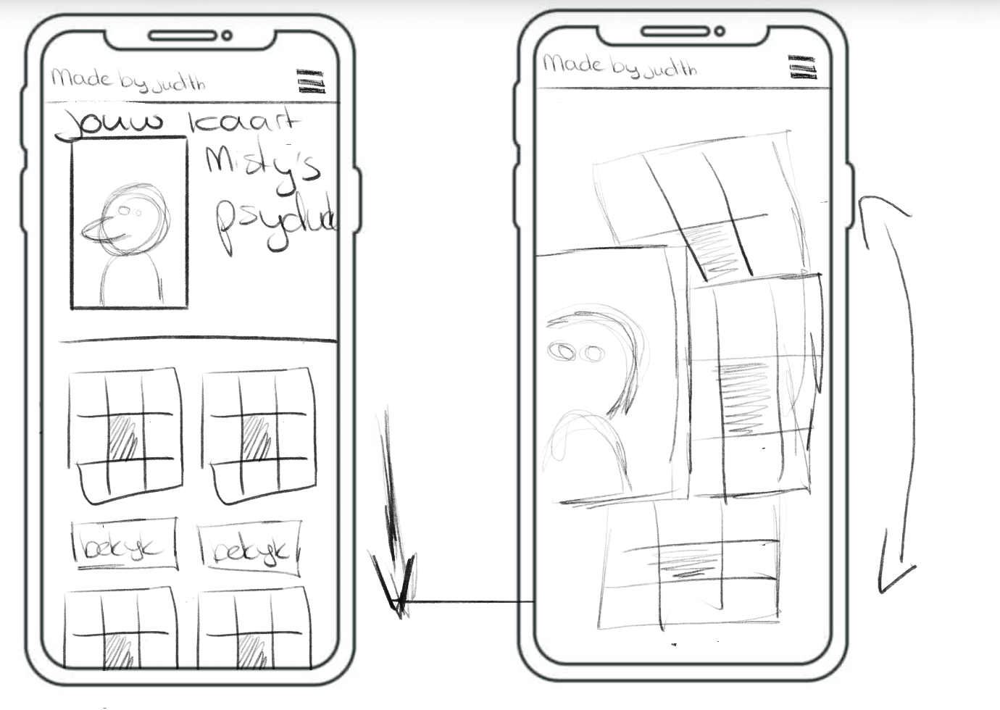
  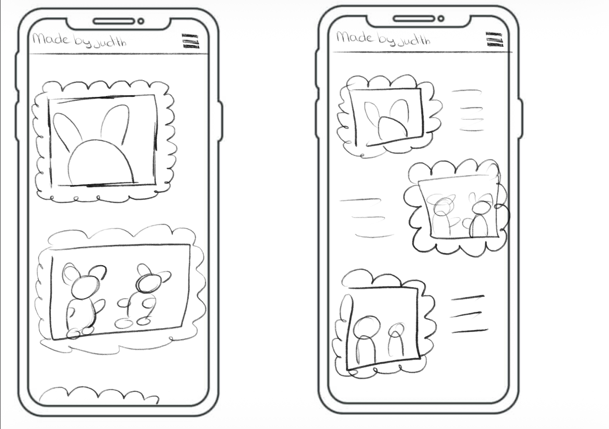
   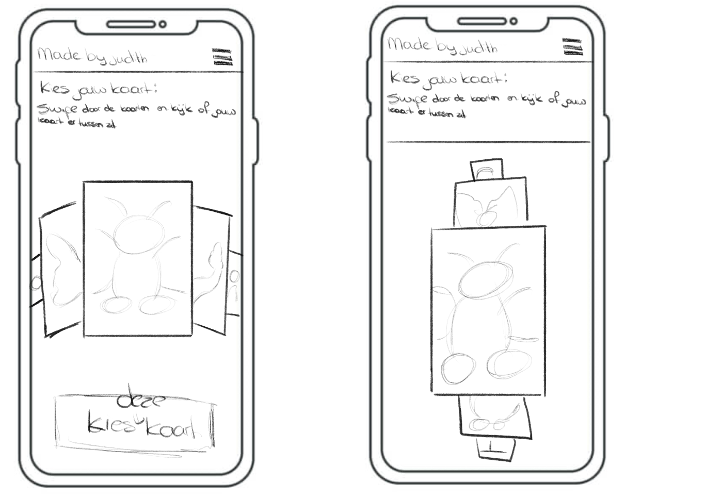

#### Vertaling naar desktop

Daarna vertaalde ik dezelfde ideeën naar een groter laptopscherm. Ik maakte geen compleet nieuwe ontwerpen, maar onderzocht hoe ik de extra ruimte kon gebruiken.
Op mobiel staat de content vooral onder elkaar. Op desktop kunnen meerdere kaarten of projecten naast elkaar staan. De belangrijkste Pokémonkaart blijft centraal staan, terwijl andere kaarten of binder-artvarianten eromheen worden geplaatst.

Ik lette erop dat:

- het belangrijkste onderdeel het meeste opvalt;
- de extra ruimte nuttig wordt gebruikt;
- meerdere afbeeldingen naast elkaar kunnen staan;
- de visuele hiërarchie hetzelfde blijft;
- hover- en focus-states mogelijk zijn;
- mobiel en desktop herkenbaar bij elkaar horen.

# foto toevoegen!!

## woensdag 9 september (online les NS-staking)

### Visual Research, Crazy 8 en schermschetsen

Tijdens deze les heb ik verder gewerkt aan de visuele stijl en indeling van mijn digital garden. Ik begon met Visual Research. Daarna maakte ik een Crazy 8, beoordeelde ik mijn ideeën en werkte ik de beste ideeën uit als mobiele en desktop-schetsen.

#### Mijn sfeerwoorden bepalen

Als uitgangspunt voor mijn Visual Research koos ik de sfeerwoorden:

- speels
- cozy
- fantasierijk
  Deze woorden passen bij mijn creatieve onderwerpen, zoals Pokémon binder art, haken, stickers en journalen. Ik wil dat mijn website persoonlijk, creatief en gezellig aanvoelt. De verschillende onderdelen mogen een eigen uitstraling hebben, maar moeten door het gebruik van kleuren en vormen wel bij elkaar passen.
  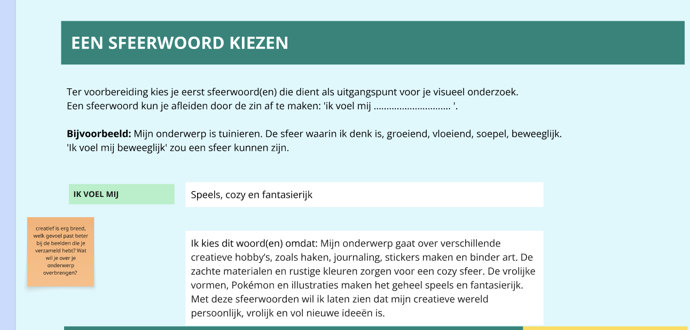

#### Stap 1: directe beelden verzamelen

Eerst verzamelde ik afbeeldingen die direct passen bij mijn hobby’s en sfeerwoorden. Ik zocht onder andere naar Pokémon, binder art, haakprojecten, journals, stickers en andere creatieve producten.
Ik keek niet alleen naar het onderwerp van de afbeeldingen, maar ook naar kleur, vorm, materiaal en uitstraling. Ik zag vooral zachte vormen, vrolijke kleuren, handgemaakte materialen en fantasierijke illustraties terug.
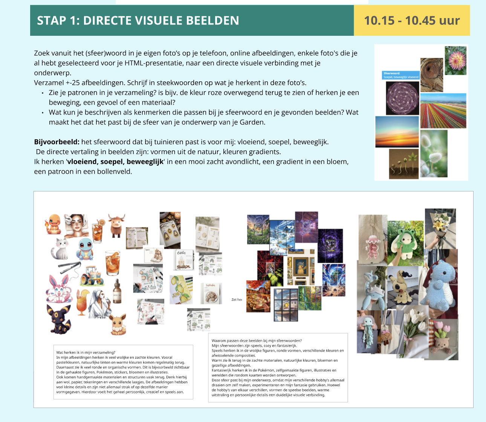

#### Stap 2: abstracte beelden verzamelen

Daarna zocht ik naar abstractere beelden. Hierbij keek ik minder naar de hobby’s zelf en meer naar de visuele kenmerken die bij mijn sfeerwoorden passen.
Ik verzamelde voorbeelden van:
zachte en organische vormen;
afgeronde vlakken;
vrolijke kleuren en pastelkleuren;
collages en patronen;
speelse typografie;
onderdelen die in elkaar overlopen.
Hierdoor ontdekte ik dat niet alleen het onderwerp, maar ook de kleuren, vormen, typografie en plaatsing de sfeer van mijn website bepalen.
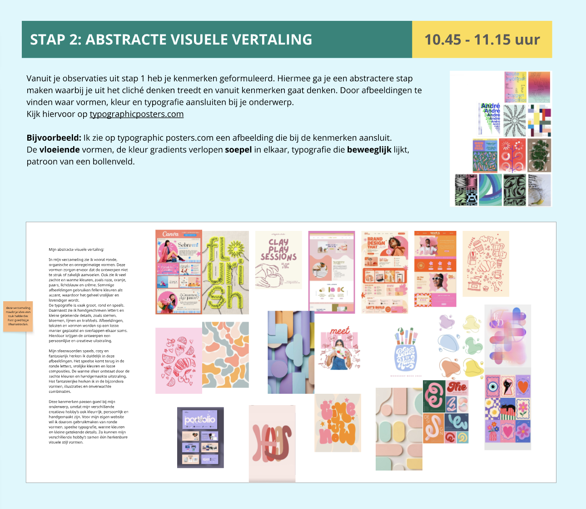

#### Stap 3: visuele uitgangspunten bepalen

Uit mijn verzameling koos ik vier afbeeldingen die mij het meeste aanspraken. Per afbeelding beschreef ik waarom deze bij mijn sfeerwoorden past en welke kenmerken ik kan gebruiken.
Daaruit kwamen de volgende visuele uitgangspunten:

- Ik gebruik afgeronde en organische vormen.
- Ik werk met zachte kleuren en enkele fellere accenten.
- Onderdelen mogen speels worden geplaatst.
- Mijn eigen projecten en afbeeldingen staan centraal.
- De website moet cozy en persoonlijk aanvoelen.
- De verschillende hobby’s moeten herkenbaar zijn, maar wel bij dezelfde stijl horen.
  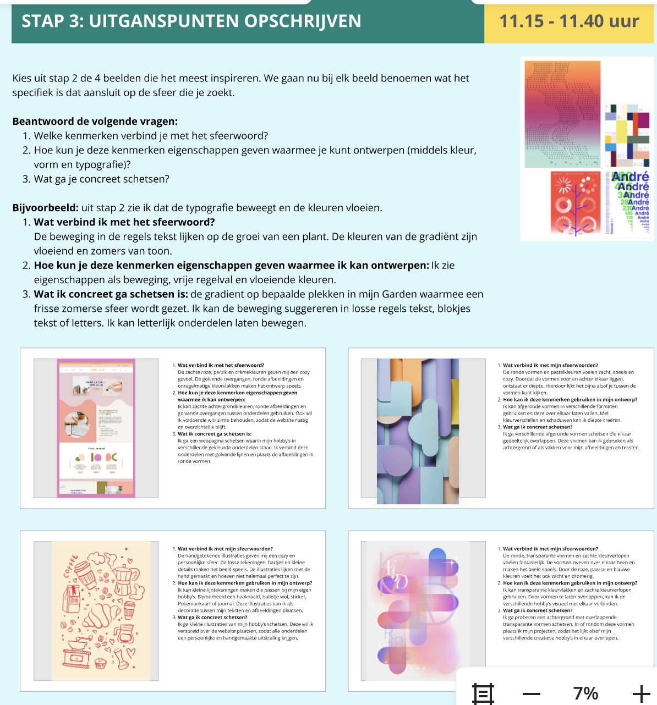

#### Crazy 8 maken

Na het Visual Research maakte ik een Crazy 8. Hierbij schetste ik in korte tijd acht verschillende ideeën:

1. Kiezen tussen Pokémonkaarten waarvoor ik binder art heb gemaakt.
2. Een kaart kiezen en de bijbehorende binder-artvarianten bekijken.
3. Mijn haakpatronen als een galerij presenteren.
4. Zelf een stickervel samenstellen.
5. Mijn creatieve proces als een flow weergeven.
6. Pokémon-types als gekleurde tegels vormgeven.
7. Het eindresultaat en proces naast elkaar tonen.
8. Extra informatie tonen wanneer de gebruiker over een bolletje beweegt of erop klikt.
   Na het schetsen annoteerde ik de ideeën. Met pijlen en korte teksten gaf ik aan wat een gebruiker kan doen en welke interacties ik voor mij zie.
   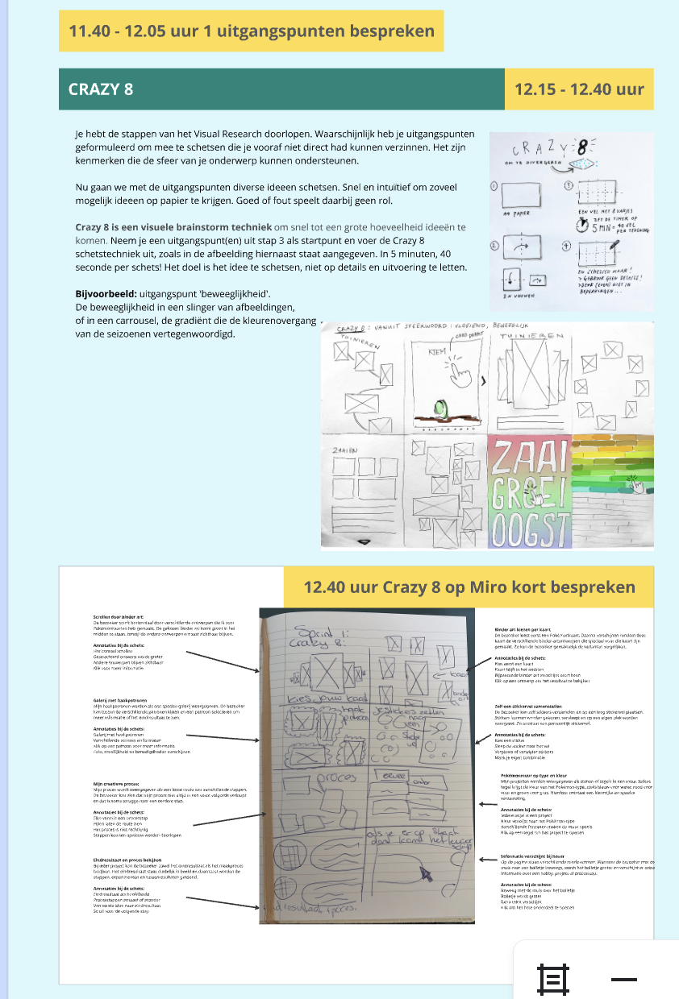

#### Mijn ideeën beoordelen

Vervolgens beoordeelde ik de acht ideeën met het bijbehorende werkvel. Per idee keek ik of het ontwerp:

- fluïde en adaptief is;
- interactief en dynamisch is;
- toegankelijk is;
- binnen de beschikbare tijd gemaakt kan worden;
- expressief genoeg is;
- leuk of verrassend is.
  Hierdoor keek ik niet alleen naar welke ideeën ik mooi vond, maar ook naar welke ideeën geschikt en haalbaar zijn voor het web. Het zelf samenstellen van een stickervel is bijvoorbeeld erg interactief, maar waarschijnlijk ook lastiger om binnen deze sprint te bouwen.
  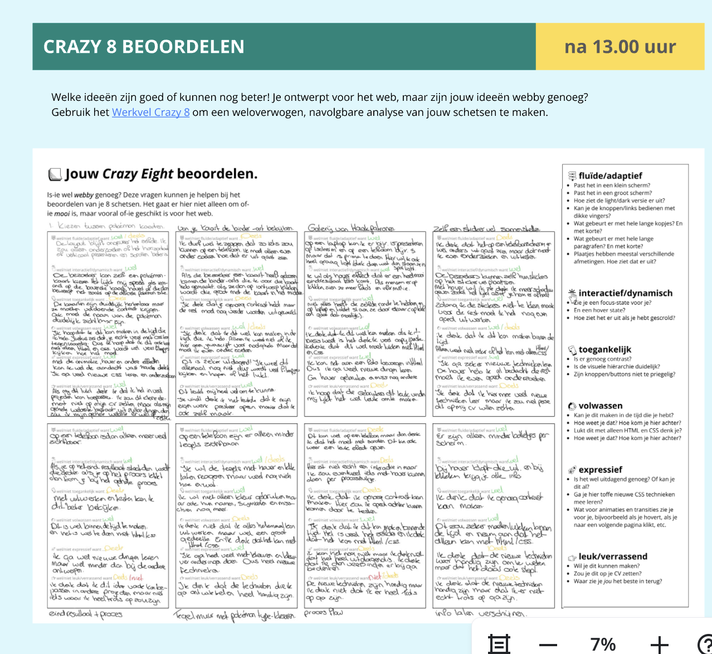

#### Ideeën verder uitwerken

Na de beoordeling koos ik drie ideeën om verder te onderzoeken:
Kiezen tussen verschillende Pokémonkaarten.
Binder art bekijken voor een gekozen kaart.
Haakpatronen als een galerij presenteren.
Bij het eerste idee controleert de gebruiker of de eigen Pokémonkaart ertussen staat. Daarna kan de gebruiker bij het tweede idee bekijken welke binder-artvarianten ik voor deze kaart heb gemaakt.
Deze ideeën passen goed bij mijn content en geven mij mogelijkheden om te experimenteren met scrollen, swipen, selecteren en het tonen van afbeeldingen.

### check-out woe. 9 sept.

1. Leg uit waar het Visual Research in 3 stappen naartoe werkt.

Bij stap 1 verzamel je directe beelden die bij je onderwerp en sfeerwoorden passen. Bij stap 2 zoek je abstractere beelden die passen bij de kleuren, vormen, typografie en uitstraling die je wilt gebruiken. Bij stap 3 kies je de belangrijkste beelden en vertaal je deze naar visuele uitgangspunten voor je eigen ontwerp.

2. Vertel in 2 zinnen waar jouw Garden over gaat en met welke content je dat gaat doen (beeld, tekst, sound, animatie enz.).

Mijn digital garden gaat over mijn haakwereld en de knuffels die ik zelf maak. Ik gebruik hiervoor foto’s, teksten, illustraties en animaties om mijn creaties en het maakproces te laten zien.

3. Vertel kort welk idee van de Crazy 8 je het liefst zou willen uitvoeren of verder zou willen onderzoeken.

Van mijn Crazy 8 wil ik het idee van de haakpatronen als galerij verder onderzoeken. Dit idee past het beste bij mij en kan ik persoonlijk maken met zachte vormen, gehaakte omlijstingen en interactieve afbeeldingen.

## voorbereiding 9 september

### Presentatie over mijn creatieve interesses

Voor woensdag 9 september moest ik een korte presentatie voorbereiden als startpunt voor mijn digital garden. In de presentatie moest ik:
mijn persoonlijke interesse uitleggen;
tien inspiratiebronnen verzamelen;
ongeveer vijftig afbeeldingen onderzoeken;
een eerste tekst van maximaal 180 tekens schrijven.

#### Een onderwerp kiezen

Eerst vond ik het lastig om een geschikt onderwerp te kiezen. Mijn eerste idee was om de presentatie over mijn studie CMD te maken. Nadat ik de opdracht beter had bekeken, begreep ik dat het onderwerp echt over een persoonlijke interesse moest gaan.
Daarna twijfelde ik tussen alleen Pokémon binder art en meerdere creatieve hobby’s. Uiteindelijk koos ik voor mijn creatieve interesses:

- haken;
- Pokémon binder art maken;
- stickers ontwerpen en maken;
- journalen.

Deze hobby’s lijken misschien verschillend, maar hebben veel overeenkomsten. Bij iedere hobby werk ik met kleuren, materialen en kleine details. Vaak begin ik met losse ideeën die tijdens het maken steeds verder groeien.
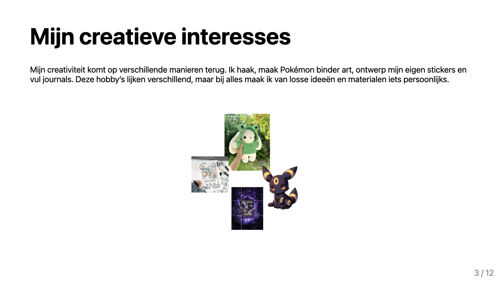

#### Inspiratie en afbeeldingen verzamelen

Voor iedere hobby heb ik afbeeldingen verzameld en een eigen collage gemaakt. Hierdoor hoefde ik niet alle vijftig afbeeldingen op één drukke slide te zetten. Ik verdeelde de collages over aparte slides voor haken, binder art, stickers en journalen.

Tijdens het onderzoeken van de afbeeldingen ontdekte ik verschillende overeenkomsten:
opvallende en bijpassende kleurencombinaties;
speelse vormen en kleine details;
digitaal en met de hand werken;
losse onderdelen samenbrengen tot één geheel;
experimenteren en ontwerpen blijven aanpassen;
iets persoonlijks en unieks maken.
Daarnaast heb ik tien links verzameld die ik als inspiratiebronnen heb gebruikt. Hiervoor heb ik gekeken naar Pokémonkaarten, haakpatronen, stickers, journals en andere creatieve voorbeelden.
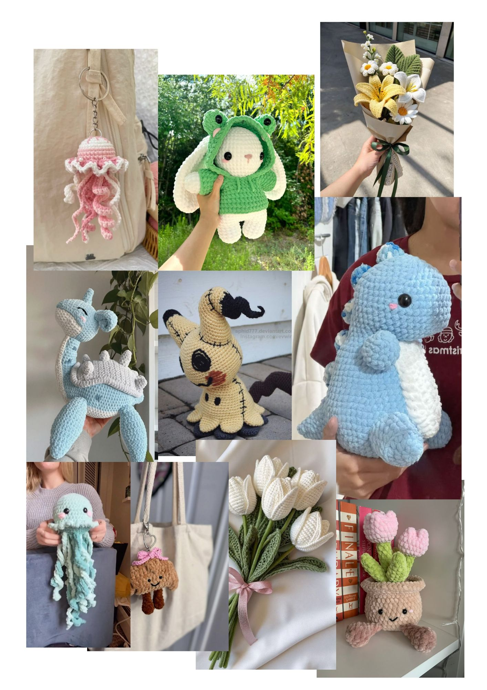

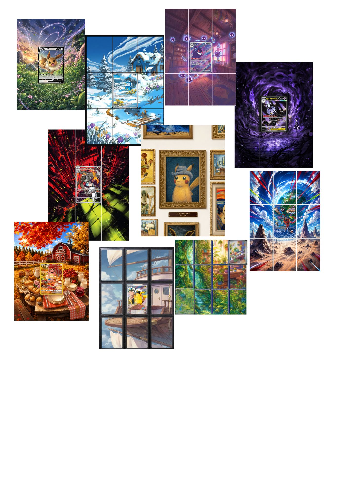

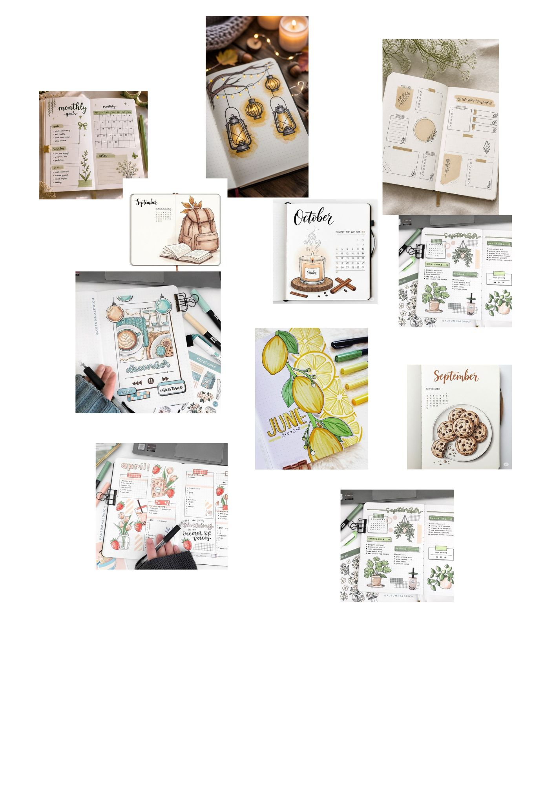

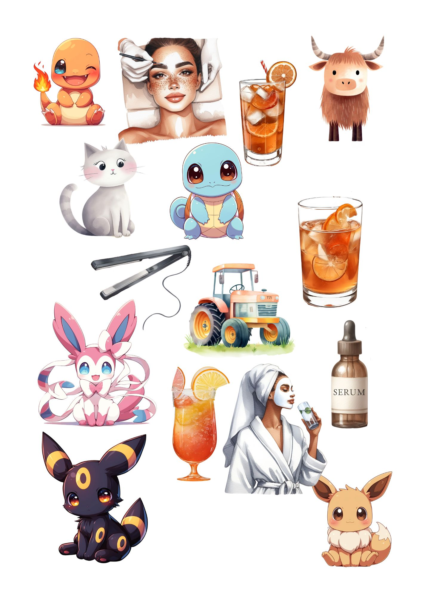

#### De presentatie maken met Remark.js

Ik heb de presentatie met Remark.js gemaakt in Visual Studio Code. Iedere nieuwe slide begint met drie streepjes:
(---)
Voor titels gebruikte ik een # en voor opsommingen een -. In mijn presentatiemap maakte ik een aparte map met de naam images. Hierin plaatste ik alle collages en screenshots.

## maandag 7 september

### Sprintplanning en onderzoek

#### Sprintplanning

Tijdens deze les zijn we begonnen met de planning van Sprint 1. De opdracht voor deze sprint is om de eerste versie van mijn eigen digital garden te ontwerpen, te realiseren en uiteindelijk te publiceren met HTML en CSS.
Het is daarbij niet alleen belangrijk dat mijn website er goed uitziet en technisch werkt. Het ontwerp moet ook ‘webby’ zijn. Dit betekent dat ik gebruik moet maken van de mogelijkheden en eigenschappen van het web. Mijn digital garden moet dus niet aanvoelen als een statische poster die toevallig online staat, maar als een website waarop bezoekers kunnen navigeren, ontdekken en verschillende soorten content kunnen bekijken.
Tijdens deze sprint wil ik daarom niet alleen aandacht besteden aan de vormgeving. Ik wil ook nadenken over de structuur, navigatie, interactie en de manier waarop verschillende onderwerpen met elkaar verbonden kunnen worden.

#### Mijn sprint plannen

Tijdens de sprintplanning hebben we gekeken naar hoe ik het werk voor deze sprint kan opdelen in kleinere en overzichtelijke taken. Hiervoor gebruiken we een projectboard met drie kolommen:

- Todo
- In Progress
- Done
  In de kolom Todo staan de taken waaraan ik nog moet beginnen. Wanneer ik met een taak bezig ben, verplaats ik deze naar In Progress. Zodra een taak helemaal is afgerond, kan ik deze verplaatsen naar Done.

Ik vind deze manier van plannen handig, omdat ik hierdoor niet alleen één grote opdracht voor mij zie. De opdracht wordt verdeeld in kleinere onderdelen die ik één voor één kan uitvoeren. Hierdoor kan ik beter zien wat er nog moet gebeuren en wordt het makkelijker om aan de opdracht te beginnen.
Door de taken steeds van Todo naar In Progress en uiteindelijk naar Done te verplaatsen, kan ik mijn voortgang tijdens de sprint bijhouden. Het geeft mij ook een duidelijker beeld van wat ik al heb gedaan en waar ik nog verder aan moet werken.

#### Onderzoek naar Digital Gardens

Na de sprintplanning hebben we ons verdiept in wat een digital garden precies is. Hiervoor hebben we verschillende artikelen gelezen en besproken.
We werkten hierbij volgens de expertgroepenmethode. Iedere groep verdiepte zich in een ander artikel. Daarna deelden we de belangrijkste informatie en inzichten met elkaar. Op deze manier hoefde niet iedereen precies hetzelfde artikel te onderzoeken en kregen we toch informatie uit meerdere bronnen.
Door de verschillende artikelen kreeg ik meerdere perspectieven op wat een digital garden kan zijn. Er bestaat namelijk niet één vaste manier waarop een digital garden eruit moet zien. Toch kwamen bepaalde eigenschappen in meerdere artikelen terug.
De belangrijkste onderwerpen die ik uit het onderzoek heb gehaald, zijn:

- een digital garden blijft groeien;
- informatie wordt georganiseerd op basis van \* verbindingen;
- het is een plek om zichtbaar te leren;
- fouten en feedback horen bij het proces;
- de website mag persoonlijk en experimenteel zijn;
- verschillende soorten content mogen door elkaar staan;
- de maker blijft eigenaar van de website en de inhoud.

#### Een Digital Garden is een groeiende plek

Een van de belangrijkste dingen die ik uit de artikelen heb gehaald, is dat een digital garden niet af hoeft te zijn.

Een normale blog bestaat vaak uit losse artikelen. Deze artikelen worden geschreven, gepubliceerd en daarna meestal niet meer aangepast. De berichten staan vaak op volgorde van publicatiedatum, waarbij het nieuwste bericht bovenaan staat.
Bij een digital garden werkt dit anders. Pagina’s en ideeën mogen blijven veranderen. Een idee kan klein en nog onvolledig beginnen. Later kan de pagina worden uitgebreid wanneer de maker meer over het onderwerp leert, nieuwe inspiratie krijgt of feedback ontvangt.
Maggie Appleton beschrijft hiervoor verschillende stadia waarin een pagina zich kan bevinden:

- 🌱 Seedling – een vroeg, klein en nog ruw idee;
- 🌿 Budding – een idee dat al verder is onderzocht en uitgewerkt;
- 🌳 Evergreen – een redelijk compleet idee dat nog steeds kan blijven veranderen.

Ik vond deze verdeling interessant, omdat hierdoor zichtbaar wordt dat niet iedere pagina op een website even ver uitgewerkt hoeft te zijn. Een korte ontdekking kan al gedeeld worden als een Seedling. Wanneer ik later meer informatie verzamel, kan deze pagina doorgroeien naar Budding en uiteindelijk naar Evergreen.
Dit haalt voor mij ook een deel van de druk weg om een pagina meteen helemaal perfect te maken. Het hoort juist bij het concept van een digital garden dat sommige ideeën nog aan het groeien zijn.

#### Informatie organiseren op basis van verbindingen

Een ander belangrijk verschil tussen een blog en een digital garden is de manier waarop de informatie wordt georganiseerd.
Bij een blog staan berichten meestal in een tijdlijn. Het nieuwste bericht staat bovenaan en oudere berichten zakken steeds verder naar beneden. De datum waarop iets is gepubliceerd, bepaalt dus voor een groot deel waar de informatie staat.
Bij een digital garden draait het veel meer om de verbindingen tussen verschillende onderwerpen. Pagina’s worden aan elkaar gekoppeld omdat de inhoud iets met elkaar te maken heeft. Een bezoeker hoeft daardoor niet één vaste route te volgen, maar kan via links steeds nieuwe onderwerpen ontdekken.
Ik vond het beeld van Maggie Appleton hierover erg duidelijk. Een traditionele tijdlijn is één rechte route, terwijl een digital garden meer lijkt op een verzameling van paden die op verschillende manieren met elkaar verbonden zijn.
Mike Caulfield beschrijft ongeveer hetzelfde verschil met de begrippen The Garden en The Stream.

- The Stream
  De Stream lijkt op sociale media. Berichten verschijnen in een tijdlijn en worden na verloop van tijd vervangen door nieuwe berichten. Oudere informatie verdwijnt steeds verder naar beneden en wordt daardoor moeilijker terug te vinden.
- The Garden
  De Garden is juist een plek waarin informatie kan blijven bestaan en verder kan groeien. Verschillende onderwerpen kunnen met elkaar worden verbonden. De bezoeker kan zelf kiezen welke route die door de informatie wil volgen.
  Dit inzicht helpt mij om anders naar de structuur van mijn eigen website te kijken. Ik hoef mijn content niet alleen op datum te sorteren. Ik kan onderwerpen ook met elkaar verbinden op basis van overeenkomsten, technieken, materialen of inspiratie.

Bij mijn eigen digital garden kan een bezoeker bijvoorbeeld vanuit een eindresultaat doorklikken naar het maakproces, de inspiratie, een experiment of een andere creatie waarin ik dezelfde techniek heb gebruikt.

#### Een plek om zichtbaar te leren

Een digital garden is niet alleen bedoeld om aan anderen te laten zien wat iemand al weet. Het kan ook een plek zijn waarop je zichtbaar maakt wat je nog aan het leren bent.
Shawn Wang noemt dit Learning in Public. Binnen zijn digital garden mogen ideeën nog onvolledig zijn en mag hij fouten maken. De bedoeling is juist dat zijn kennis blijft veranderen wanneer hij iets nieuws leert of feedback ontvangt.
Dit maakt een digital garden voor mij anders dan een portfolio. In een portfolio laat ik meestal mijn beste en meest uitgewerkte werk zien. Het eindresultaat staat daar vaak centraal.

In een digital garden mag ik juist ook laten zien:

- welke ideeën ik heb onderzocht;
- welke vragen ik nog heb;
- welke experimenten wel of niet werkten;
- wat ik tijdens het maken heb ontdekt;
- hoe mijn ontwerp is veranderd;
- welke feedback ik heb ontvangen;
- wat ik later nog verder wil onderzoeken.
  Hierdoor hoeft mijn digital garden niet alleen een verzameling van perfecte eindproducten te worden. Het mag ook een verzameling zijn van schetsen, experimenten, ontdekkingen en ideeën die nog in ontwikkeling zijn.

Dit past goed bij mijn eigen ontwerp- en maakproces. Mijn eerste idee is namelijk niet altijd meteen het uiteindelijke idee. Door mijn tussenstappen te laten zien, wordt beter zichtbaar hoe ik tot een eindresultaat ben gekomen.

#### Feedback en fouten horen bij het proces

Bij Learning in Public hoort ook dat andere mensen feedback kunnen geven.

In het artikel Digital Garden Terms of Service wordt beschreven dat bezoekers mogen aangeven wanneer informatie niet klopt of wanneer zij het ergens niet mee eens zijn. De schrijver ziet dit niet meteen als iets negatiefs, maar juist als een mogelijkheid om verder te leren.
Wanneer nieuwe informatie laat zien dat iets niet klopt, kan een pagina opnieuw worden aangepast. De inhoud staat dus niet voor altijd vast.

Dit sluit goed aan bij het idee dat een digital garden nooit helemaal klaar is. Feedback, nieuwe kennis en nieuwe ervaringen kunnen ervoor zorgen dat een pagina opnieuw verandert.
Ik vind dit een interessant uitgangspunt voor mijn eigen website. Als een onderdeel nog niet goed werkt of als ik later een beter idee krijg, betekent dit niet dat mijn eerdere werk waardeloos was. Het laat juist zien hoe mijn kennis en ontwerp zich ontwikkelen.

#### Mijn eigen website bezitten

Een ander onderwerp dat in het onderzoek naar voren kwam, is independent ownership. Dit betekent dat je digital garden echt van jezelf is en niet volledig afhankelijk is van een bestaand platform.
Wanneer iemand alleen gebruikmaakt van Instagram, TikTok, Facebook, X of Medium, bepaalt dat platform voor een groot deel hoe de content eruitziet en hoe bezoekers deze kunnen bekijken. Als het platform de regels of mogelijkheden verandert, heb je daar als gebruiker weinig controle over.

Bij een eigen website heb ik meer controle over:

- de vormgeving;
- de indeling van de pagina’s;
- de navigatie;
- de soorten content die ik plaats;
- de verbindingen tussen onderwerpen;
- de manier waarop mijn website zich later ontwikkelt.

Met HTML en CSS bouw ik mijn eigen plek op het internet. Ik kan daardoor zelf bepalen hoe mijn digital garden eruitziet en hoe bezoekers door de inhoud bewegen.
Dit sluit goed aan bij de opdracht, omdat we onze digital garden zelf gaan ontwerpen, bouwen en publiceren.

#### Waar had ik het meeste aan?

Waar ik tijdens deze les het meeste aan had, was het idee dat een digital garden niet af hoeft te zijn.
Normaal heb ik snel het gevoel dat iets eerst helemaal goed en uitgewerkt moet zijn voordat ik het kan laten zien. Bij een digital garden hoort het juist bij het concept dat ideeën nog groeien en veranderen.

Ik vond vooral het verschil tussen Seedling, Budding en Evergreen duidelijk. Deze termen maken zichtbaar dat niet iedere pagina hetzelfde niveau van uitwerking hoeft te hebben. Een klein idee kan al onderdeel zijn van de website en later verder worden aangevuld.
Ook het verschil tussen The Garden en The Stream heeft mij geholpen. Ik begrijp hierdoor beter dat ik mijn website niet alleen als een lijst met nieuwe berichten moet zien. Ik kan onderwerpen juist met elkaar verbinden, zodat bezoekers zelf verschillende routes door mijn website kunnen volgen.
Daarnaast vond ik het idee van Learning in Public interessant. Mijn digital garden hoeft niet alleen te laten zien wat ik al kan. Ik mag ook laten zien wat ik nog aan het ontdekken en leren ben.

### Bronnen:

- Maggie Appleton – informatie over Digital Gardens en de groeistadia Seedling, Budding en Evergreen;
- Mike Caulfield – The Garden and the Stream;
- Shawn Wang – Learning in Public;
  Digital Garden Terms of Service;
  You and Your Mind Garden;
  MIT Technology Review – artikel over de ontwikkeling en persoonlijke vorm van Digital Gardens.

### chech-out: heel kort

1. Een digital garden is een persoonlijke website waarop ideeën en projecten blijven groeien. Anders dan een gewone website hoeft de inhoud niet direct af of perfect te zijn.

2. Een website is ‘webby’ wanneer je de mogelijkheden van het web gebruikt, zoals links, interacties, animaties en verschillende routes. Vooral persoonlijke en speelse websites inspireren mij.

3. Ik wil mijn digital garden over mijn haakwereld maken. Hierin wil ik mijn haakcreaties, patronen, inspiratie en maakproces op een persoonlijke en interactieve manier laten zien.

# Sprint 0:

## vrijdag 4 september

### Deep Dive schetsen

Tijdens deze Deep Dive heb ik geleerd dat schetsen niet alleen bedoeld is om iets mooi te tekenen. Het helpt vooral om na te denken, ideeën te onderzoeken en ontwerpkeuzes zichtbaar te maken. Een belangrijke uitspraak uit de les was:
Schetsen = denken = niet in één keer ‘klaar’.
Een schets hoeft dus niet perfect te zijn. Het belangrijkste is dat ik ideeën snel zichtbaar kan maken en verschillende mogelijkheden kan vergelijken.

#### Oude schetsen vergelijken

Voor de eerste opdracht heb ik schetsen uit eerdere projecten meegenomen, zoals logoschetsen, Crazy 8’s, interfaces, typografie, positionering en uitgewerkte tekeningen.
Mijn tekening van D’Oude Veiling laat duidelijk het eindresultaat zien, maar minder goed hoe ik tot dit ontwerp ben gekomen. Mijn Crazy 8 ziet er minder netjes uit, maar laat juist verschillende oplossingen zien. Bij mijn schetsen voor de positionering en typografie van mijn campagnewebsite is mijn proces nog duidelijker zichtbaar door de varianten en annotaties.
Hierdoor leerde ik dat een mooie schets niet automatisch een goede ontwerpschets is.

#### Een goede schets

Een goede schets hoeft voor mij niet perfect te zijn, maar moet wel mijn denkproces zichtbaar maken. Daarbij helpen:

- meerdere ideeën en varianten;
- annotaties, pijlen en korte teksten;
- verschillende lijndiktes, kleuren, highlights en schaduwen;
- het zichtbaar maken van interacties en verschillende states.
  Annotaties zijn handig omdat ik daarmee iets kan uitleggen zonder alles volledig te tekenen.

#### Oefenen met de basis

We hebben geoefend met lijnen, vormen, grids en interfaces. Ik heb geleerd dat ik eerst met eenvoudige vormen de basis kan neerzetten en daarna details kan toevoegen.
Ook hebben we het verschil tussen low-fi en hi-fi behandeld. Een low-fi schets is eenvoudig en bedoeld om snel een idee of indeling te onderzoeken. Een hi-fi uitwerking bevat meer details en lijkt meer op het uiteindelijke ontwerp.
Met dikkere lijnen en highlights kan ik belangrijke onderdelen benadrukken. Schaduwen kunnen bijvoorbeeld duidelijk maken dat iets klikbaar is. Door annotaties in een andere kleur te schrijven, blijft het verschil tussen mijn ontwerp en mijn uitleg zichtbaar.
Interactie en animatie schetsen

Een website bestaat niet alleen uit stilstaande schermen. Een gebruiker kan klikken, swipen en hoveren. Deze interacties kan ik schetsen met pijlen, stippellijnen, annotaties, kleuren en verschillende states.
Met de zoom-techniek kan ik één onderdeel groter tekenen om te laten zien wat er verandert. In de les zagen we bijvoorbeeld hoe een sidebar verschijnt, hoe een icoon verandert nadat het is geselecteerd en hoe een swipe nieuwe opties zichtbaar maakt.

#### Wat heb ik hier het meest van geleerd?

Ik heb vooral geleerd dat schetsen een manier van denken is. Het is juist waardevol om meerdere versies te maken, dingen opnieuw te proberen en erbij te schrijven waarom ik bepaalde keuzes maak.
Bij het ontwerpen van mijn website wil ik daarom niet meteen één idee volledig uitwerken. Ik wil eerst verschillende mogelijkheden onderzoeken. Daarbij ga ik ook schetsen hoe gebruikers door mijn website bewegen en hoe onderdelen reageren op klikken, swipen en hoveren.

### Deep Dive – Pick 'n' Mix

Tijdens de Deep Dive hebben we verder gekeken naar hoe je een passend lettertype kiest en hoe je verschillende lettertypes met elkaar kunt combineren. Daarbij kwamen veel dingen uit de artikelen terug.
Bij het kiezen van een lettertype kan ik onder andere kijken naar:

- stijl – past de uitstraling bij wat ik wil communiceren?
- leesbaarheid – blijft de tekst duidelijk?
- opties – welke varianten en mogelijkheden heeft de fontfamilie?
- beschikbaarheid – kan en mag ik het lettertype daadwerkelijk gebruiken?
  We hebben ook gekeken naar de geschiedenis van verschillende soorten lettertypes. In de slides kwamen onder andere Fraktur, Venetian, Old Face, Transitional, Modern, Egyptian en Sans voorbij. Hierdoor kon ik goed zien dat lettertypes door de jaren heen steeds andere kenmerken hebben gekregen.

#### Leesbaarheid

Een onderdeel waar ik veel aan had was het verschil in leesbaarheid tussen lettertypes.
Zelfs wanneer verschillende lettertypes allemaal op bijvoorbeeld 18 px staan, kunnen ze toch heel verschillend groot ogen. Dit komt onder andere door de x-hoogte en de verhoudingen van de letters. In de slides werd dit zichtbaar gemaakt door verschillende lettertypes op dezelfde grootte naast elkaar te zetten.
Hierdoor begrijp ik beter dat ik bij mijn website niet alleen kan zeggen: "18 px is groot genoeg." Ik moet het lettertype daadwerkelijk op mijn website bekijken en testen of het prettig leesbaar is.

#### Lettertypes combineren

We hebben daarna gekeken naar het combineren van lettertypes. Wat ik hiervan vooral heb onthouden, is dat een goede combinatie vaak bestaat uit een balans tussen contrast en overeenkomst.
Contrast kan bijvoorbeeld ontstaan door:

- sans serif tegenover serif;
- bold tegenover light;
- narrow tegenover wide;
- roman tegenover italic of small caps.
  Tegelijkertijd kunnen de lettertypes overeenkomsten hebben, bijvoorbeeld doordat ze uit dezelfde fontfamilie komen, dezelfde letterontwerper hebben, een vergelijkbare constructie hebben of uit ongeveer dezelfde periode komen.
  Ik vond dit vooral handig omdat ik hiervoor bij het combineren van lettertypes voornamelijk keek naar of ik ze mooi bij elkaar vond staan. Nu weet ik beter naar welke eigenschappen ik kan kijken om uit te leggen waarom twee lettertypes wel of niet bij elkaar passen.

#### Waar had ik het meeste aan?

Waar ik het meeste aan had, is dat ik nu veel beter begrijp dat een lettertype kiezen niet alleen een visuele keuze is. Hiervoor keek ik vooral naar welk lettertype ik mooi vond en of het bij mijn ontwerp paste. Nu weet ik dat ik ook moet kijken naar leesbaarheid, x-hoogte, verschillende gewichten en stijlen, taalondersteuning, het apparaat waarop de tekst wordt bekeken en waarvoor het lettertype gebruikt gaat worden.
Voor mijn eigen website vind ik vooral de leesbaarheid belangrijk. Mijn portfolio moet er natuurlijk bij mij passen en een eigen uitstraling hebben, maar bezoekers moeten de informatie ook makkelijk kunnen lezen en snel kunnen vinden.
Ook het combineren van lettertypes vond ik erg nuttig. Ik weet nu dat ik niet zomaar twee mooie lettertypes naast elkaar moet zetten, maar dat ik kan zoeken naar een combinatie met zowel contrast als overeenkomst. Dat geeft mij veel meer houvast wanneer ik straks de typografie voor mijn eigen website ga bepalen.

Wat ik uiteindelijk vooral meeneem uit deze voorbereiding en Deep Dive is:
Ik moet een lettertype niet alleen kiezen omdat ik het mooi vind, maar omdat het past bij de boodschap, goed leesbaar is én goed werkt op de plek waar ik het ga gebruiken.

## voorbereiding voor 4 september

### Voorbereiding Deep Dive: Typografie

Voor deze Deep Dive heb ik twee artikelen gelezen over het kiezen en gebruiken van lettertypes. Tijdens het lezen heb ik per artikel de dingen opgeschreven die ik het belangrijkste of opvallendste vond.

### Artikel 1: How to choose the right typeface

In dit artikel wordt uitgelegd dat het kiezen van een lettertype niet alleen gaat om welk lettertype je mooi vindt. Je moet vooral kijken naar waarvoor je het lettertype gaat gebruiken, wat je ermee wilt uitstralen en of het technisch geschikt is.

Wat ik uit dit artikel heb gehaald:

1. Kijk eerst waarvoor je het lettertype gaat gebruiken.Een lettertype voor een grote titel heeft andere eigenschappen nodig dan een lettertype voor lange stukken tekst. Bij langere teksten is leesbaarheid veel belangrijker, terwijl je bij een grote titel meer ruimte hebt voor een opvallend lettertype.

2. Gebruik liever niet te veel verschillende lettertypes.Voor veel ontwerpen kan één goede fontfamilie al genoeg zijn, omdat daar bijvoorbeeld regular, bold en italic varianten in zitten. Meer lettertypes gebruiken betekent dus niet automatisch dat een ontwerp beter wordt.

3. Een lettertype moet passen bij de boodschap die je wilt overbrengen.Lettertypes hebben een bepaalde uitstraling en kunnen daardoor invloed hebben op hoe de inhoud overkomt. Een lettertype kan bijvoorbeeld formeel, modern, rustig of juist opvallend voelen. Het is daarom belangrijk dat de uitstraling past bij de boodschap van het ontwerp.

4. Controleer welke tekens en talen een lettertype ondersteunt.Dit vond ik iets waar ik zelf niet zo snel aan zou denken. Niet ieder lettertype bevat automatisch alle accenten, symbolen en speciale tekens. Je kunt dus een mooi lettertype kiezen en er later achter komen dat bepaalde tekens die je nodig hebt ontbreken.

5. Niet ieder lettertype werkt even goed op een scherm.Sommige lettertypes zijn speciaal gemaakt om ook op kleinere formaten en beeldschermen goed leesbaar te blijven. Hele dunne of gedetailleerde letters kunnen er mooi uitzien, maar op een klein scherm juist minder goed werken.

6. Bij het combineren van lettertypes moet er samenhang én verschil zijn.Lettertypes hoeven niet precies hetzelfde te zijn om goed bij elkaar te passen. Het kan juist helpen als er contrast is, maar ze moeten wel een bepaalde overeenkomst hebben in bijvoorbeeld uitstraling of bedoeling. Ook helpt het als de lettertypes verschillende functies krijgen, bijvoorbeeld één voor koppen en één voor lopende tekst.

### Artikel 2: Typography for User Interfaces

Bij dit artikel ging het veel meer over typografie binnen interfaces en websites. Wat ik hier vooral interessant aan vond, is dat tekst eigenlijk een heel groot onderdeel van een interface is. Typografie bepaalt daardoor niet alleen hoe een website eruitziet, maar ook hoe makkelijk iemand hem kan gebruiken.

Wat ik uit dit artikel heb gehaald:

1. Tekst is een onderdeel van de interface zelf.Een interface bestaat voor een groot deel uit woorden: knoppen, menu's, titels, labels en andere teksten. Typografie is daarom niet alleen iets wat je achteraf mooi maakt, maar hoort echt bij het ontwerpen van de interface.

2. Letters moeten duidelijk van elkaar te onderscheiden zijn.Bij een interface is leesbaarheid extra belangrijk. Letters zoals een hoofdletter I, kleine l en bijvoorbeeld het cijfer 1 kunnen bij sommige lettertypes heel erg op elkaar lijken. Hierdoor moet een gebruiker meer moeite doen om de tekst te begrijpen.

3. Een goed lettertype voor een interface hoeft niet de aandacht te trekken.Het lettertype moet de gebruiker vooral helpen om de inhoud te begrijpen. Het hoeft dus niet altijd het meest bijzondere of opvallende lettertype te zijn. De gebruiker moet eigenlijk zonder moeite kunnen lezen wat er staat.

4. Een UI-lettertype moet op verschillende formaten werken.Een website kan bekeken worden op een groot computerscherm, maar ook op een kleine telefoon. Daarom moet een lettertype flexibel zijn en ook bij kleinere tekstgroottes goed leesbaar blijven.

5. De x-hoogte heeft invloed op de leesbaarheid.De x-hoogte is de hoogte van kleine letters, gemeten aan bijvoorbeeld de letter x. Een grotere x-hoogte kan ervoor zorgen dat tekst op kleine formaten makkelijker leesbaar is. Te groot is alleen ook weer niet altijd beter, omdat sommige letters dan juist moeilijker van elkaar te onderscheiden kunnen worden.

6. Mensen lezen tekst in een interface anders dan een lange tekst.In een interface staan vaak losse woorden of korte stukjes tekst, zoals bij een menu of knop. Daardoor is het extra belangrijk dat individuele letters en woorden snel herkenbaar zijn.

#### Wat vond ik het opvallendst?

Ik vond het interessant dat een lettertype binnen een interface eigenlijk niet te veel aandacht hoeft te trekken. In eerste instantie kijk ik bij een lettertype snel naar de uitstraling. Door dit artikel begrijp ik beter dat een lettertype vooral de gebruiker moet ondersteunen en de inhoud duidelijk moet maken.

#### Wat heb ik van deze voorbereiding geleerd?

Door deze twee artikelen begrijp ik dat typografie veel meer is dan het kiezen van een mooi lettertype. Een lettertype moet passen bij het doel en de uitstraling van mijn website, maar het moet vooral goed leesbaar en bruikbaar zijn.
Bij het kiezen van mijn lettertypes wil ik daarom letten op:

- de leesbaarheid van titels en lopende tekst;
- de uitstraling die bij mijn onderwerp past;
- het aantal lettertypes en varianten;
- de herkenbaarheid van verschillende letters en cijfers;
- de beschikbare tekens en symbolen;
- de leesbaarheid op desktop en mobiel;
- het verschil en de samenhang tussen mijn fonts.

Wat ik vooral meeneem, is dat ik mijn keuze niet alleen moet kunnen uitleggen met ‘ik vind dit lettertype mooi’. Ik moet ook kunnen onderbouwen waarom het bij mijn website past en waarom het voor de gebruiker prettig leesbaar is.

## woensdag 2 september

### verwerking van de les

#### Voorbereiding

Voor deze les had ik de artikelen van Interneting Is Hard gelezen en de pagina Structuring content with HTML van MDN gescand. Tijdens het lezen heb ik aantekeningen gemaakt en twee vragen meegenomen naar de les. Ook had ik opgeschreven welke dingen mij tijdens het lezen verwonderden.
Mijn volledige aantekeningen en voorbereiding staan eerder in mijn Learning Log.

#### Antwoorden op mijn vragen

Tijdens mijn voorbereiding had ik twee vragen opgeschreven die ik tijdens de les wilde stellen.

1. Wanneer kan ik beter een HTML-element als selector gebruiken en wanneer een class?
   Tijdens de les kwam ik erachter dat we binnen dit project geen classes mogen gebruiken. Het is juist de bedoeling dat we leren om HTML-elementen op andere manieren te selecteren met CSS. Hierdoor moet ik dus verder kijken dan alleen een class toevoegen wanneer ik één specifiek onderdeel wil vormgeven.
   Dit vind ik eigenlijk wel interessant, omdat ik normaal waarschijnlijk snel een class zou gebruiken. Nu word ik gedwongen om beter naar mijn HTML-structuur en CSS-selectors te kijken.

2. Welke CSS-regel krijgt voorrang wanneer meerdere regels hetzelfde element aanpassen?
   Ik heb geleerd dat de volledige manier waarop CSS bepaalt welke regel voorrang krijgt best complex is. De docent gaf aan dat we daar op dit moment nog niet helemaal diep op in hoeven te gaan.
   Wat ik voor nu vooral moet onthouden is:
   Hoe specifieker een CSS-regel is, hoe meer voorrang deze heeft.
   Voor nu is dit voldoende om mee te werken. Later gaan we waarschijnlijk dieper in op hoe deze voorrang precies wordt berekend.

#### Wat mij verwonderde

Tijdens mijn voorbereiding had ik al een aantal dingen gevonden die mij verwonderden, onder andere tijdens het scannen van MDN. Zo kwam ik erachter dat een decoratieve afbeelding juist een lege alt="" kan krijgen en dat ‘klik hier’ geen goede tekst voor een link is.
Deze verwonderingen en mijn uitleg daarbij heb ik al bij mijn voorbereiding uitgewerkt.

#### Nieuwe bron uit de les; HTML5 Doctor

Tijdens de les kregen we ook HTML5 Doctor als website mee. Deze website kan ik gebruiken om meer te ontdekken over HTML-elementen en om op te zoeken waarvoor verschillende elementen bedoeld zijn.
Dit sluit goed aan op wat we nu aan het leren zijn, omdat we niet alleen moeten kijken naar hoe iets eruitziet, maar ook naar welk HTML-element inhoudelijk het beste past bij de content.

#### Wat neem ik mee uit deze les?

Door mijn voorbereiding had ik al kennisgemaakt met HTML-structuur, semantiek, CSS-selectors en de cascade. Tijdens de les zijn vooral mijn vragen hierover duidelijker geworden.
Ik weet nu dat ik binnen dit project niet zomaar classes kan gebruiken en daardoor bewuster moet nadenken over mijn HTML-structuur en de manier waarop ik elementen selecteer. Ook weet ik dat CSS-regels verschillende prioriteiten kunnen hebben en dat ik voor nu vooral moet onthouden dat de specifiekste regel voorrang krijgt.
Daarnaast heb ik met HTML5 Doctor een nieuwe bron gekregen die ik tijdens het maken van mijn website kan gebruiken wanneer ik niet weet welk HTML-element ik het beste kan gebruiken.

Vanwege een priva afspraak heb ik helaas niet de tweede deepdive kunnen maken

## Voorbereidingen 2 september

### Voorbereiding basis HTML, CSS, fonts en kleur

Voor de voorbereiding van de les heb ik informatie gelezen over webfonts, HTML en CSS. Hierdoor begrijp ik beter hoe een website wordt opgebouwd en welke keuzes ik moet maken bij het gebruiken van lettertypen.

### Web-safe fonts en @font-face

Ik heb geleerd dat een lettertype beschikbaar moet zijn op het apparaat van de bezoeker of door de website geladen moet worden. Er zijn hiervoor drie mogelijkheden:
Web-safe fonts: deze lettertypen staan standaard op de meeste apparaten. Ze laden snel en gebruiken geen extra data. Voorbeelden hiervan zijn Arial, Verdana, Georgia en Times New Roman.
Webfontservices: dit zijn diensten zoals Google Fonts en Adobe Fonts. Tijdens deze opdracht mogen wij deze niet gebruiken. Ze kunnen namelijk zorgen voor minder privacy, extra laadtijd en afhankelijkheid van een externe dienst.

@font-face: hiermee kan ik een lettertype zelf downloaden, in mijn projectmap zetten en vanuit mijn CSS-bestand laden.
Met font-family bepaal ik welk lettertype een element krijgt. Als ik een lettertype aan de body geef, wordt dit meestal automatisch overgenomen door de elementen die hierin staan. Dit heet inheritance.
Ik kan ook verschillende lettertypen achter elkaar plaatsen. Dit heet een font-stack. Als het eerste lettertype niet geladen kan worden, probeert de browser automatisch het volgende lettertype.
body {
font-family: Georgia, Times, serif;
}
Met system-ui gebruikt de website het standaardlettertype van het besturingssysteem. Hierdoor kan het lettertype er op een Windows-computer bijvoorbeeld iets anders uitzien dan op een MacBook.
Wanneer ik een zelf gedownload lettertype wil gebruiken, maak ik eerst een map voor de fontbestanden. Daarna koppel ik het lettertype bovenaan mijn CSS-bestand met @font-face.
@font-face {
font-family: "Dyna Puff";
src: url("../fonts/DynaPuff-Bold.ttf");
}

body {
font-family: "Dyna Puff", sans-serif;
}

Een fontfamilie kan uit verschillende bestanden bestaan, zoals regular, italic, bold en bold italic. Met font-weight en font-style geef ik aan welke variant bij ieder bestand hoort. De browser kan daarna automatisch de juiste variant gebruiken.
Ik heb ook geleerd dat het niet slim is om heel veel lettertypen en varianten aan mijn website toe te voegen. Hierdoor moet de bezoeker meer bestanden downloaden en kan de website langzamer worden. Daarnaast moet ik controleren of de licentie van een lettertype het gebruik op een website toestaat.

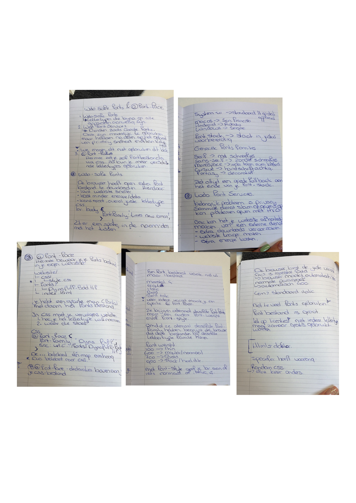

### HTML & CSS Is Hard

Voor de voorbereiding heb ik de onderdelen Introduction, Basic Web Pages en Hello, CSS van HTML & CSS Is Hard gelezen.
In Introduction heb ik geleerd dat HTML, CSS en JavaScript ieder een eigen functie hebben. HTML bepaalt de inhoud en structuur van een website. CSS wordt gebruikt voor de vormgeving en JavaScript maakt interacties mogelijk.

In Basic Web Pages heb ik geleerd hoe een HTML-pagina wordt opgebouwd met html, head en body. Ook kwamen headings, paragrafen en lijsten aan bod. HTML bepaalt dus niet alleen wat er op een pagina staat, maar geeft ook betekenis en structuur aan de inhoud.
In Hello, CSS heb ik geleerd hoe ik een CSS-bestand aan HTML kan koppelen. Een CSS-regel bestaat uit een selector, een property en een value. Daarnaast heb ik gelezen over kleuren, lettertypen, meeteenheden, inheritance en de cascade.
Door deze artikelen begrijp ik beter dat HTML en CSS twee verschillende taken hebben, maar wel met elkaar samenwerken. HTML bepaalt wat een onderdeel is en CSS bepaalt hoe dit onderdeel eruitziet.

Na het lezen had ik nog twee vragen:
Wanneer kan ik beter een HTML-element, zoals p of h1, als selector gebruiken en wanneer is een class handiger?
Hoe bepaalt CSS welke regel voorrang krijgt als meerdere regels hetzelfde element aanpassen?

### MDN – Structuring content with HTML

Ik heb ongeveer een half uur scannend gelezen op MDN. Ik heb vooral gekeken naar semantische elementen, zoals header, nav, main, section, article en footer. Deze elementen geven betekenis aan de verschillende onderdelen van een pagina. Dit is duidelijker dan wanneer een hele website alleen met div-elementen wordt opgebouwd.
Ook heb ik gekeken naar links, afbeeldingen, formulieren en tabellen. Bij deze onderwerpen kwam toegankelijkheid vaak terug. Goede HTML helpt niet alleen de browser, maar ook zoekmachines en screenreaders om een website beter te begrijpen.

Ik vond het opvallend dat niet iedere afbeelding een uitgebreide alt-tekst nodig heeft. Als een afbeelding alleen ter decoratie wordt gebruikt, kan deze alt="" krijgen. Een screenreader weet dan dat de afbeelding kan worden overgeslagen.
Ook heb ik geleerd dat ‘klik hier’ geen goede linktekst is. Zonder extra context is namelijk niet duidelijk waar de link naartoe gaat. Een tekst zoals ‘Bekijk mijn contactgegevens’ vertelt veel duidelijker wat iemand na het aanklikken kan verwachten.

### Wat ik hiervan heb geleerd

Ik heb vooral geleerd dat HTML niet alleen bepaalt wat er op het scherm staat. Door semantische elementen, duidelijke linkteksten en passende alt-teksten te gebruiken, kan ik mijn website begrijpelijker en toegankelijker maken.
Daarnaast begrijp ik nu beter hoe lettertypen op het web werken. Voor deze opdracht kan ik een web-safe font gebruiken of een zelf opgeslagen lettertype met @font-face aan mijn website koppelen. Daarbij moet ik niet alleen kijken naar wat ik mooi vind, maar ook letten op leesbaarheid, fallbacks, bestandsgrootte, privacy en de licentie van het lettertype.
Voor mijn eigen website wil ik daarom bewust omgaan met de hoeveelheid fonts en varianten die ik toevoeg. Ik wil een stijl kiezen die bij mijn onderwerp past, maar mijn website moet ook duidelijk leesbaar zijn en snel blijven laden.

foto: van mijn aantekeningen.

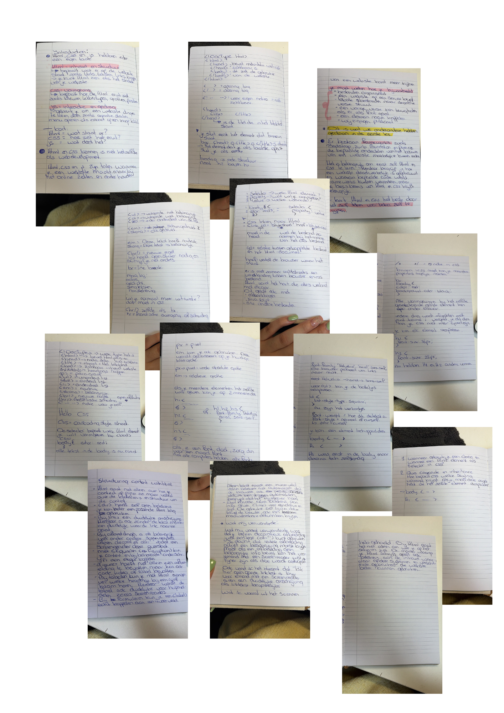

## kick-off

31 augustus: Check out

1. Wat is een source hosting platform en welke heb ik gekozen?
   Een source hosting platform is een online plek waar je de bestanden en code van een project kunt opslaan en beheren. Het handige hiervan is dat verschillende versies van je code worden bijgehouden. Hierdoor kun je later terugzien welke aanpassingen je hebt gemaakt en wanneer je deze hebt gemaakt.

Voor mijn website gebruik ik GitHub als source hosting platform. De code van mijn website staat hierdoor online in een repository. De bestanden pas ik aan in Visual Studio Code en daarna stuur ik de nieuwste versie naar GitHub. Met GitHub Pages kan ik mijn website vervolgens online publiceren.

Mijn repository op GitHub, waarin de bestanden en verschillende versies van mijn website worden opgeslagen.
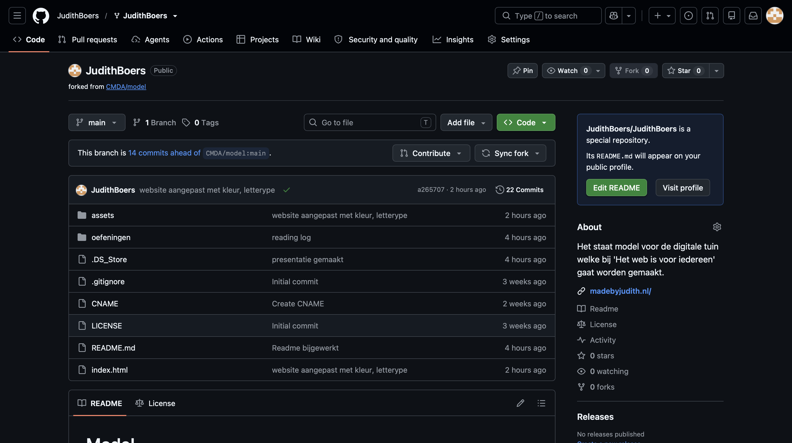
Deze foto is wel later toegevoeegd omdat ik niet wist dat dat moest.

2. Welke domeinnaam heb ik gekozen en hoe heb ik deze gekoppeld?
   Ik heb gekozen voor de domeinnaam madebyjudith.nl. Ik heb bewust voor deze naam gekozen omdat ik de website uiteindelijk als mijn persoonlijke portfolio wil blijven gebruiken. Ik kan hier mijn projecten uit het eerste jaar op zetten, maar later ook nieuw werk toevoegen. Zo kan mijn portfolio met mij meegroeien en kan ik de website later gebruiken bij het zoeken naar een stage of werk.

   Om mijn domeinnaam aan mijn website te koppelen, heb ik binnen GitHub Pages mijn eigen domein ingevuld. Daarna heb ik bij mijn domein de benodigde DNS-instellingen aangepast. De uitleg en gegevens die ik hiervoor nodig had, kon ik op DLO vinden.
   Nadat ik deze instellingen had toegevoegd, controleerde GitHub de verbinding. Ik kreeg daarna de melding ‘DNS check successful’. Dit betekende dat mijn GitHub-pagina goed was gekoppeld aan madebyjudith.nl.

Foto: domeinkiezen

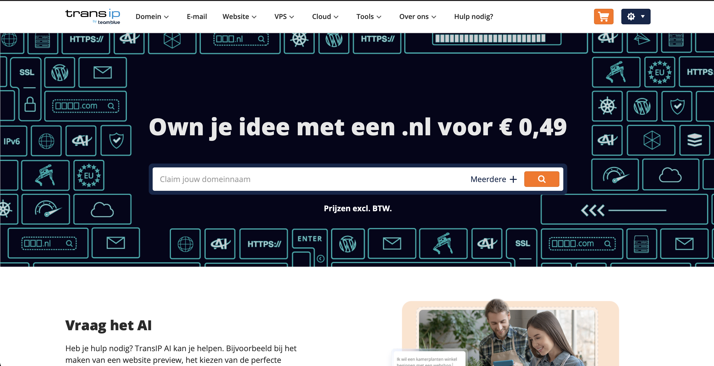

3. Hoe pas ik mijn website aan en publiceer ik deze online?
   Ik pas mijn website aan in Visual Studio Code. Hier kan ik bijvoorbeeld veranderingen maken in mijn HTML- en CSS-bestanden. Tijdens het werken gebruik ik Go Live om mijn website lokaal in de browser te bekijken. Zo kan ik eerst controleren hoe mijn aanpassingen eruitzien, voordat ik ze online publiceer.
   Wanneer ik tevreden ben, sla ik mijn bestanden op. Daarna open ik in Visual Studio Code het onderdeel Source Control. Hier zet ik de aangepaste bestanden klaar en maak ik een commit. Bij deze commit schrijf ik een korte beschrijving van wat ik heb veranderd. Vervolgens push of synchroniseer ik de commit naar GitHub.
   GitHub ontvangt dan de nieuwste versie van mijn bestanden. Via GitHub Pages wordt deze versie automatisch gepubliceerd. Na een korte tijd zijn mijn veranderingen ook zichtbaar op madebyjudith.nl.
   Mijn werkwijze is:
   Aanpassen → testen met Go Live → opslaan → committen → pushen naar GitHub → online publiceren via GitHub Pages

Foto: eerste versie van mijn website.

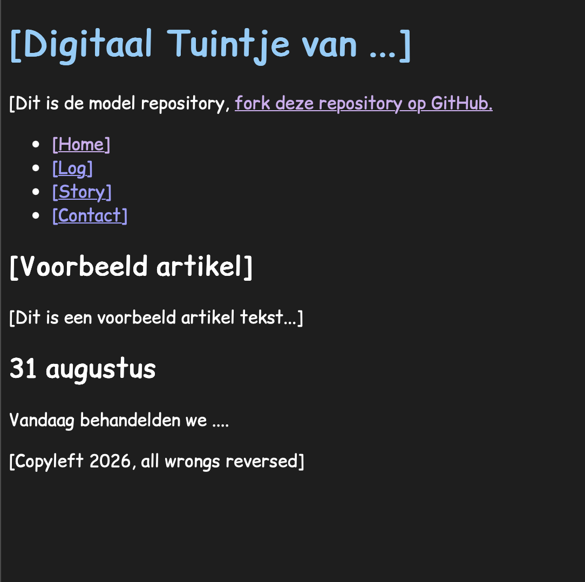
